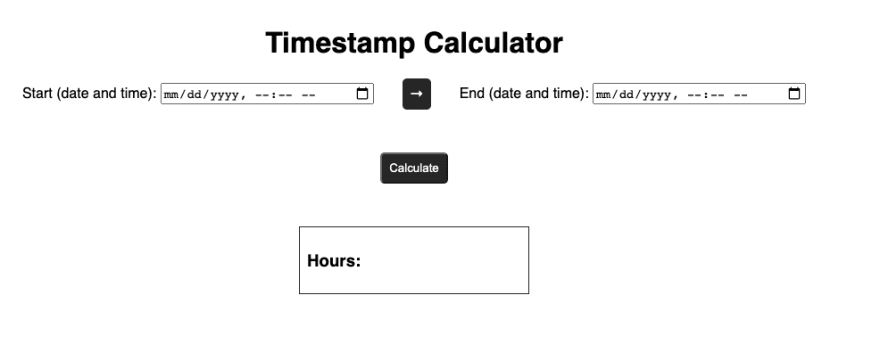

Recently, I was writing a CRUD application that kept track of a “start time” and “end time” for entries that were created and stored in a database. I could subtract these time values to find a simple “length of time” for each entry. But retrieving the time data in a useful format was a bit more difficult than I expected.


## Date and Time Gotchas

The hardest part of dealing with time data is the likelihood that an edge case is going to throw your application for a loop. Things like localization, 24-hour vs 12-hour time, and other topics present interesting challenges.

In my application, one difficult concept was making it possible for the user to create an entry that lasted for over 24 hours. Working within the constraints of an AM / PM format can pose a significant challenge on its own.

The following micro-project is intended to put on display some of the helpful things I’ve discovered about working with timestamps in JavaScript, and particularly in terms of calculating the value of a passage of time.

## Setting Up the Project

This is a very basic project, and there is only minimal CSS that I won't include here. The HTML sets up a basic calculator outline with two datetime-local inputs.
```markup
 <body>
    <h1>Timestamp Calculator</h1>
    <div class="container">
      <form>
        <label for="start">Start (date and time):</label>
        <input type="datetime-local" id="start" name="start" />
      </form>
      <p>→</p>
      <form>
        <label for="start">End (date and time):</label>
        <input type="datetime-local" id="end" name="end" />
      </form>
    </div>
    <button id="calculate">Calculate</button>
    <div class="result-container">
      <h3>Hours:</h3>
      <h3 class="result" id="result"></h3>
    </div>
  </body>
```

The JavaScript is as follows:

```javascript

const startInput = document.getElementById('start');
const endInput = document.getElementById('end');
const calculateButton = document.getElementById('calculate');
const result = document.getElementById('result');

calculateButton.addEventListener('click', () => {
  const startTime = new Date(startInput.value).getTime();
  const endTime = new Date(endInput.value).getTime();

  if (isNaN(startTime) || isNaN(endTime)) {
    alert('Please make sure to select a start and end time.');
    return;
  }

  if (startTime > endTime) {
    alert('Please make sure end time is a later value than start time.');
    return;
  }

  result.innerText = `${((endTime - startTime) / 3600000).toFixed(2)}`;
});
```

The project looks like this so far:



<figcaption>The initial calculator design</figcaption>

## Project Explanation

### 1. Retrieve Time String with Input type='datetime-local'

This HTML input type does most of the heavy lifting for localization. This will create a calendar-like input that includes a time field in either 12 or 24-hour format depending on the defaults of the user’s operating system.


<figcaption>An HTML datetime calendar picker</figcaption>

When you retrieve the value of the input in JavaScript, you will have access to a string that looks like the following:

<code>2020-07-21T16:20</code>

### 2. Convert Date String into a Unix Timestamp (milliseconds since 01/01/1970)

The callback function that fires when the Calculate button is clicked is going to translate the date string associated with your time inputs into a number value.

We have created a variable that corresponds with the values of each of the input fields. We then create a new <code>Date</code> object for each of these values, and pass in the values to create the date. Then, we use the <code>.getTime()</code> method built into the Date object to convert our strings into a Unix timestamp.

This timestamp is highly malleable and will bypass many of the gotchas regarding the handling of time data. This number is referred to as either Unix time or Epoch time, and in JavaScript, it represents the number of milliseconds that have passed since the beginning of 1970.

The reason this is awesome is that dealing with time data in the format of a string, object, or other data type is going to present significant challenges when the edge cases of your application start cropping up. If your application is configured from the ground up to accept time data __exclusively__ in Unix format, you can easily manipulate your Unix data as necessary to display useful information to the user. We will do this in the next step.

### 3. Manipulate Unix Timestamp for the Front End

In the case of this project, and the CRUD application that I talked about earlier, I want to show the user the number of hours that have passed from the start time to the end time.

This comes down to a basic calculation of subtracting the Unix value of the end time by the Unix value of the start time. This will result in a difference of milliseconds that we can divide by the number of milliseconds in an hour (3,600,000). Finally, we can further clean things up by rounding to the second decimal place with <code>.toFixed(2)</code>.

After this calculation is complete, we update the value of our “result” element to display the number of hours that have passed on the front end.


<figcaption>The working calculator with an example value</figcaption>

## Applying this in Other Scenarios

The beautiful thing about working with Unix time data is how universally malleable it is. In most cases, it bypasses limitations set forth by localization, user time display preferences, and other situations that are challenging to manage.

### Important Caveat about Storing Time Data

This project serves as a very simple demonstration of using time data in JavaScript, but it does not cover some of the important aspects of storing and displaying that data for later use. When JavaScript converts a time string to Unix time, it will use UTC. This is usually in your best interest as it is beneficial to have all your time data stored as UTC, but there will be an additional step for displaying that data in a useful time format depending on the location of your users.

In other words, store the data in UTC, and convert the front end representation of that data to the local time of the user.

## Key Takeaway

Working with dates and times in JavaScript (and any programming language) comes with a lot of “gotchas”. When you start factoring in any sort of complex functionality that your app may require, you may want to consider implementing Unix time to save yourself from many administrative headaches.

I’d love to know if you have any other suggestions on how to deal with time in JavaScript, so please let me know if I’m missing out on something cool.

Thanks for reading.