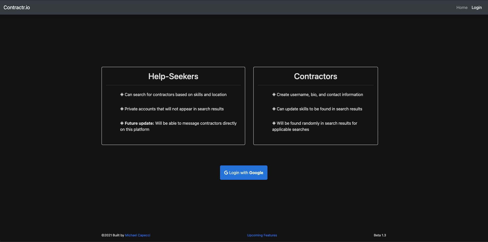

## About

Contractr.io is a web application for helping connect users with local professionals of any discipline. The application includes a filtering system that allows users to find contractors within a defined range of certain zip codes.

Unauthenticated users are allowed to search freely from the database of listed contractors.

On the other hand, contractor accounts come with a different set of abilities. This account type can post bio information, skills, and will appear in search results based on zip code location.

### Key Technologies

React, Bootstrap, Node.js, Express, MySQL

