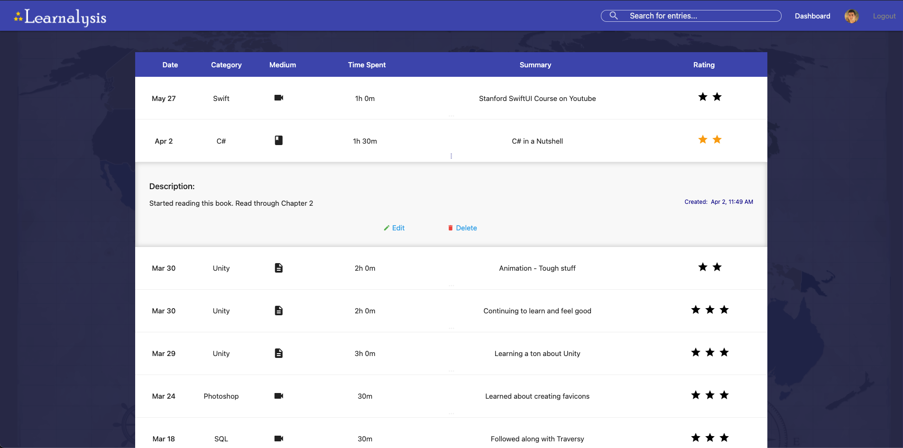

## About

Learnalysis is a web application for helping users track their progress across all of their learning endeavors.

The application features Google OAuth, helpful stats that users can read to gain insight on their learning activity, and a sleek material UI that makes using the application feel good.

### Key Technologies

React, Materialize CSS, Node.js, Express, MongoDB

