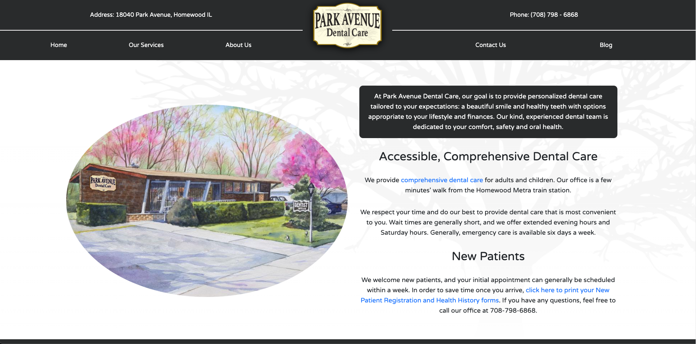

## About

The Park Avenue Dental Care website was originaly built in late 2019, and its main function is to help patients request dates and times for scheduling appointments. This website was built from the ground up with HTML, CSS, and JavaScript. The site is hosted on Netlify.

Interestingly, there is also a serverless lambda function running on form submissions. This allows for a highly-efficient solution of emailing form data to the Park Avenue front office staff.

### Key Technologies

HTML, CSS, JavaScript

