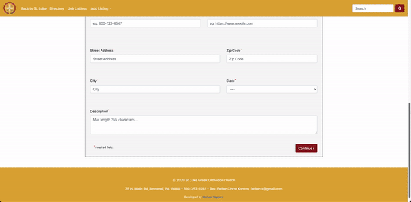

## About

The St. Luke Business Directory is a web application that was built for the members of the St. Luke church in the Greater Philadelphia area. The objective was to create an environment where business owners could list there businesses, and members of the church could filter through available businesses with ease.

This application also features a built-in admin panel that allows logged-in administrators to approve and deny business listing requests, edit existing content, and perform other managerial tasks.

### Key Technologies

React, Bootstrap, Node.js, Express, MongoDB
